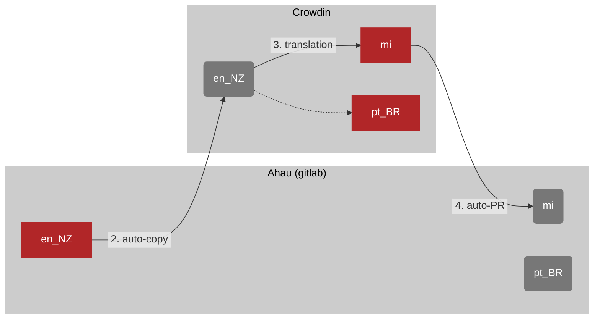

# Translation

## Technology

`vue-i18n` for handling translation strings in Vue
- https://www.npmjs.com/package/vue-i18n/v/8.28.2
- https://kazupon.github.io/vue-i18n/

Crowdin making translations
- https://ahau.crowdin.com/u/projects/2

## Workflow

1. A new translation string is defined in the Ahau repo, in `en_NZ` (New Zealand English)
2. Crowdin integration auto-copies `en_NZ` (the "source language") up to ahau.crowdin.com
3. Translators work translate from copy on Crowdin into "target language" `mi` (Te Reo Maori)
4. Crowdin auto-opens PRs to the Ahau repo
5. Changes are merged

Key:
- **red boxes** are the source of truth for a given language
- **grey boxes** are _copies_ of the source of truth defined somewhere else

## Relevant files

- translation files: `ui/src/translations/**`
- i18n plugin: `ui/src/plugins/i18n.js`
- locale picker: `ui/src/components/LocalePicker.vue` 

## Guides

### How to add a new language

1. In Crowdin, add a new language
    - https://ahau.crowdin.com/u/projects/2/languages
    - you can attempt to pre-populate translation with machine-learning/guesses
        1. go to https://ahau.crowdin.com/u/projects/2
        2. click "Pre-Translate"
2. Wait for the PR which adds the translation files to Ahau
3. Add `ui/src/translations/<new_lang>/index.js` (copy the pattern from other folders)
4. Update `ui/src/translations/index.js` (copy the pattern)
5. Update `ui/src/components/LocalePicker.vue` (copy the pattern)

### How to add a new translation file

We split our translations up by page/ view/ component to group the context.
If you have a new component/ domain you're building, you _should_ make a new translation file.

Say we're adding a "verification" feature:

1. Create `ui/src/translations/en_NZ/verification.json`
2. Add translation strings to this
3. Wire this file in in 

## Glossary

- i18n : internationalisation
- l10n : localisation

